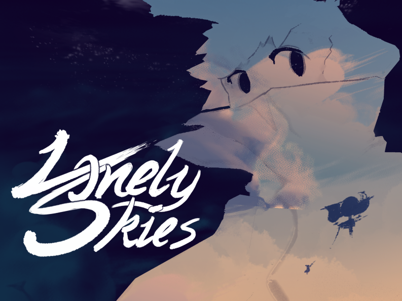

    <a href="#games" style="padding: 5pt; min-width: 20pt;">Games</a>
    <a href="#music" style="padding: 5pt; min-width: 20pt;">Music</a>
    <a href="#art" style="padding: 5pt; min-width: 20pt;">Art</a>

    <h1 style="text-align-last: justify;" id="games">⧨ ▿ ▿ ▿ ▿ Games</h1>
    

        

            
        

        

            
        

    

    

        <h3 style="text-align-last: justify;">>>> Smaller&#8239;&#8239;Games</h3>
        
<a href="/games/guys.html">Guys™ - 2023</a>
  
        
<a href="/games/mini-glolf.html">Mini-Glolf - 2021</a>
  
        
<a href="/games/match-girl.html">Match Girl - 2018</a>

        
<a href="/games/midnight-city.html">Midnight City - 2017</a>

    

    <h1 style="text-align-last: justify;" id="music">Music ▿ ▿ ▿ ▿ ⧩</h1>
    <h3 style="text-align-last: justify;">>>> Soundtracks</h3>
    

        <iframe width="100%" height="400" scrolling="no" frameborder="no" allow="autoplay" 
        src="https://w.soundcloud.com/player/?url=https%3A//api.soundcloud.com/playlists/1843173648&color=%23060606&auto_play=false&hide_related=false&show_comments=false&show_user=true&show_reposts=false&show_teaser=true"></iframe>
        <iframe width="100%" height="400" scrolling="no" frameborder="no" allow="autoplay" 
        src="https://w.soundcloud.com/player/?url=https%3A//api.soundcloud.com/playlists/1843153092&color=%232a2a46&auto_play=false&hide_related=false&show_comments=false&show_user=true&show_reposts=false&show_teaser=true"></iframe>
    

    

    <iframe width="100%" height="300" scrolling="no" frameborder="no" allow="autoplay" 
    src="https://w.soundcloud.com/player/?url=https%3A//api.soundcloud.com/playlists/1843164420&color=%23161616&auto_play=false&hide_related=false&show_comments=false&show_user=true&show_reposts=false&show_teaser=true"></iframe>
    <iframe width="100%" height="300" scrolling="no" frameborder="no" allow="autoplay" 
    src="https://w.soundcloud.com/player/?url=https%3A//api.soundcloud.com/playlists/1843171878&color=%235a5062&auto_play=false&hide_related=false&show_comments=false&show_user=true&show_reposts=false&show_teaser=true"></iframe>
    

    <h1 style="text-align-last: justify;" id="art">⧨ ▿ ▿ ▿ ▿ Art</h1>
    <h3>The Core Mechanics player logos</h3>
    

        

            
Inspired by a series of Titanfall-themed fictitious logos by reddit user raisinsucks, I created a series of logos to submit to Blaseball Cares (Blaseball's fan-run charity merch store) representing popular interpretations of players from the Blaseball team The Core Mechanics.

            
The logos represent the personality and identity of the player through the lense of a business they might feasibly run, or just one that matches their vibe.

            
After the first wave of logos I noticed that they all also plausibly represented the player's head or face, so I made that part of my design goals moving forward.

        

        <figure>
            
            <figcaption>
                <h4>Willowtree Botanical Gardens</h4>
                <h5>[ Wave 1 ]</h5>
                
Jolene Willowtree, star pitcher and (depending on who you ask) literal willow tree.

                
This logo was originally only meant to depict a tree, but I noticed in retrospect that it could also be read as a profile-view of someone facing to the right, with the trunk of the tree as the front of their neck.

            </figcaption>
        </figure>
        <figure>
            
            <figcaption>
                <h4>Suljak Glassworks</h4>
                <h5>[ Wave 1 ]</h5>
                
Bottles Suljak, a glass blower and blacksmith who is made of glass.

                
I iterated on this one for a while but it ended up being one of my favorites of the set.

                
It depicts a klein bottle, a nod to the surreal nature of the setting, and can also be read as Bottles' head facing to the left, with the negative space in the klien bottle becoming a pair of goggles.

            </figcaption>
        </figure>
        <figure>
            
            <figcaption>
                <h4>Drumsolo Community Lounge</h4>
                <h5>[ Wave 1 ]</h5>
                
Kelvin Drumsolo, a drummer with flaming hair and a spiderlike prosthetic leg assembly with a built-in drum kit.

                
This logo depicts a front-on view of a kick drum in flames, which can also be read as a stand-in for Kelvin's head and flaming hair. Originally I had the text "CORE" on the front of the drum, but it cluttered and confused the design too much.

            </figcaption>
        </figure>
        <figure>
            
            <figcaption>
                <h4>Holbrook Arcade</h4>
                <h5>[ Wave 1 ]</h5>
                
Gia Holbrook, a fun-loving robot with a monitor head.

                
Simple in concept but tricky in execution, this logo depicts the screen area of an arcade cabinet with a pair of smiling eyes on the screen. The eyes are based on a very popular depiction of the character by Blaseball community member WiresInABox.

                
This is easily the most visually complex logo in the first wave, but I think I succeeded at boiling down the essential elements of an arcade cabinet and simplifying the shapes enough that it doesn't stand out.

            </figcaption>
        </figure>
        <figure>
            
            <figcaption>
                <h4>Judochop Books & Comics</h4>
                <h5>[ Wave 2 ]</h5>
                
Adelaide Judochop, a tokusatsu-inspired action hero with a dual persona.

                
The logo depicts an open book viewed head-on, as well as a hand chopping several boards in half. I think this is inarguably the weakest depiction of a player's face in the set by virtue of how un-face-shaped the design ended up being, but the two halves of the book can be read as a pair of eyebrows.

                
I originally planned to call this one "Books & Unbooks" as a nod to Adelaide's notable stint with the "Subtractor" mod, but including comics felt more true to their characterization in the community, and "Comics & Uncomics" wasn't nearly as catchy.

            </figcaption>
        </figure>
        <figure>
            
            <figcaption>
                <h4>McElroy Textile Supply</h4>
                <h5>[ Wave 2 ]</h5>
                
Shirai McElroy, a so-called "Textile Mechanic"

                
This logo depicts a roll of fabric that is also a snail, a nod to Shirai's original team The Ohio Worms (which used a snail as their icon). It also represents Shirai's iconic snail-themed hard hat.

            </figcaption>
        </figure>
        <figure>
            
            <figcaption>
                <h4>Snart Medical Clinic</h4>
                <h5>[ Wave 2 ]</h5>
                
Ilane Snart, a doctor who is a snake.

                
The connection between a snake doctor and the symbolic rod of asclepius was too natural to pass up. This logo evokes that symbol by depicting a snake draped over a rod.

                
The body of the snake forms two major loops, which evoke the round glasses that Snart is often depicted wearing. In addition, the snake has a forked tail, suggesting a forked tongue.

            </figcaption>
        </figure>
        <figure>
            
            <figcaption>
                <h4>Taswell Wedding Planners</h4>
                <h5>[ Wave 2 ]</h5>
                
Bees Taswell, a swarm of bees in the shape of a person.

                
One of the more notable things about Bees Taswell was their wedding to another Bee-themed player, Inez Owens, which became a kind of community event.

                
The logo depicts a bee trailing pollen, which is also a party ball dropping confetti. Since Bees Taswell is just a swarm of bees, depicting a single bee is as close to depicting the player's face as it's possible to get.

            </figcaption>
        </figure>
    

